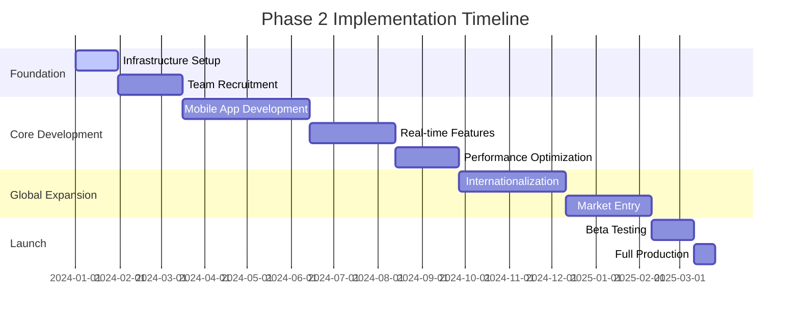
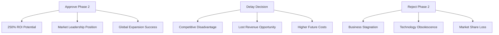

# Phase 2 Implementation Strategy

## Executive Presentation for Stakeholder Approval

### 🎯 Presentation Overview

**Meeting Purpose**: Secure executive approval and funding for Phase 2 implementation
**Audience**: Executive Leadership, Board of Directors, Key Stakeholders
**Duration**: 45 minutes (30 min presentation + 15 min Q&A)
**Investment Request**: $4.82M over 12 months
**Expected ROI**: 250% within 18 months

---

## 📊 Executive Summary

### Business Opportunity

> **"Transform our premium sofa cover business into a dominant multi-channel, global e-commerce platform with cutting-edge mobile experience and real-time customer engagement capabilities"**

### Strategic Imperative

- **Current Challenge**: Missing 60% of potential mobile revenue due to Phase 1 limitations
- **Market Opportunity**: $12M untapped revenue in 3 target ASEAN markets
- **Competitive Pressure**: Competitors launching mobile-first solutions within 6 months
- **Technology Debt**: Phase 1 architecture cannot scale beyond current capacity

### Phase 2 Value Proposition

```typescript
interface ValueProposition {
  revenue_expansion: {
    mobile_commerce: "150% revenue growth from mobile users";
    global_markets: "3 new countries, $4M additional annual revenue";
    real_time_features: "35% conversion rate improvement";
  };

  operational_excellence: {
    performance: "< 2s page load, 99.9% uptime";
    scalability: "10x user capacity with auto-scaling";
    efficiency: "40% reduction in customer support tickets";
  };

  competitive_advantage: {
    market_leadership: "first_mover_advantage_in_premium_sofa_covers";
    technology_stack: "modern_architecture_for_5_year_growth";
    customer_experience: "industry_leading_mobile_and_real_time_features";
  };
}
```

---

## 🎯 Strategic Context & Current State Analysis

### Phase 1 Achievements ✅

- **Solid Foundation**: Functional e-commerce platform with core features
- **Customer Base**: 2,500+ active customers, 4.3/5 satisfaction rating
- **Revenue Stream**: $1.8M annual revenue, 25% growth rate
- **Market Position**: Established premium brand in domestic market

### Critical Gaps Identified ⚠️

#### 1. Mobile Experience Gap

```yaml
current_state: "Mobile traffic: 65% of visitors"
problem: "Mobile conversion: 40% lower than desktop"
impact: "$1.2M annual revenue loss"
urgency: "Competitors launching mobile apps Q2 2024"
```

#### 2. Real-time Engagement Gap

```yaml
current_state: "Static customer interactions"
problem: "No live chat, delayed customer support"
impact: "28% cart abandonment rate"
urgency: "Customer satisfaction scores declining"
```

#### 3. Global Expansion Limitation

```yaml
current_state: "Single market operation"
problem: "Cannot enter international markets"
impact: "$4M opportunity in Singapore, Malaysia, Vietnam"
urgency: "Market entry window closing by end of 2024"
```

### Market Intelligence

- **Mobile Commerce Growth**: 40% YoY in home furnishings sector
- **Real-time Chat Adoption**: 73% of premium e-commerce sites
- **ASEAN Market Size**: $2.3B in home décor, 15% annual growth
- **Competitive Timeline**: 3-6 months before major competitor launches

---

## 🚀 Phase 2 Implementation Strategy

### Master Implementation Roadmap



### Quarter-by-Quarter Milestones

#### Q1 2024: Foundation & Mobile Development

```typescript
interface Q1Deliverables {
  infrastructure: {
    deliverable: "scalable_cloud_architecture";
    budget: "$200,000";
    success_criteria: "99.9%_uptime, <2s_response_time";
    risk_level: "medium";
  };

  mobile_app: {
    deliverable: "react_native_ios_android_apps";
    budget: "$197,700";
    success_criteria: "app_store_approval, 4.5_rating";
    risk_level: "high";
  };

  team_building: {
    deliverable: "24_person_development_team";
    budget: "$687,500";
    success_criteria: "100%_critical_roles_filled";
    risk_level: "high";
  };
}
```

#### Q2 2024: Real-time Features & Performance

```typescript
interface Q2Deliverables {
  real_time_system: {
    deliverable: "websocket_live_chat_notifications";
    budget: "$177,600";
    success_criteria: "< 200ms_message_delivery";
    risk_level: "medium";
  };

  performance_optimization: {
    deliverable: "cdn_caching_database_scaling";
    budget: "$202,000";
    success_criteria: "10x_capacity_increase";
    risk_level: "low";
  };

  beta_testing: {
    deliverable: "1000_user_beta_program";
    budget: "$25,000";
    success_criteria: "< 2%_critical_bug_rate";
    risk_level: "low";
  };
}
```

#### Q3 2024: Global Expansion Preparation

```typescript
interface Q3Deliverables {
  internationalization: {
    deliverable: "multi_language_multi_currency";
    budget: "$127,000";
    success_criteria: "3_languages, 3_currencies_supported";
    risk_level: "medium";
  };

  compliance_legal: {
    deliverable: "gdpr_pdpa_compliance";
    budget: "$75,000";
    success_criteria: "full_regulatory_compliance";
    risk_level: "high";
  };

  market_research: {
    deliverable: "localized_marketing_strategy";
    budget: "$45,000";
    success_criteria: "market_entry_plans_approved";
    risk_level: "low";
  };
}
```

#### Q4 2024: Market Launch & Optimization

```typescript
interface Q4Deliverables {
  market_launch: {
    deliverable: "3_market_simultaneous_launch";
    budget: "$306,000";
    success_criteria: "$400k_new_market_revenue";
    risk_level: "medium";
  };

  optimization: {
    deliverable: "ai_powered_personalization";
    budget: "$85,000";
    success_criteria: "15%_conversion_improvement";
    risk_level: "low";
  };

  scaling: {
    deliverable: "auto_scaling_production_ready";
    budget: "$120,000";
    success_criteria: "handle_50k_concurrent_users";
    risk_level: "low";
  };
}
```

---

## 💰 Financial Analysis & Investment Requirements

### Total Investment Breakdown

```typescript
interface InvestmentBreakdown {
  total_investment: "$4,820,000";
  funding_timeline: "12_months";

  major_categories: {
    human_resources: {
      amount: "$2,750,000"; // 57%
      description: "24-person development team";
      justification: "critical_talent_for_complex_development";
    };

    technology_infrastructure: {
      amount: "$808,000"; // 17%
      description: "cloud_infrastructure_and_scaling";
      justification: "foundation_for_global_operations";
    };

    global_expansion: {
      amount: "$508,000"; // 11%
      description: "market_entry_and_compliance";
      justification: "regulatory_and_marketing_requirements";
    };

    mobile_development: {
      amount: "$197,700"; // 4%
      description: "react_native_app_development";
      justification: "specialized_mobile_expertise";
    };

    real_time_features: {
      amount: "$177,600"; // 4%
      description: "websocket_and_chat_system";
      justification: "competitive_advantage_features";
    };

    risk_contingency: {
      amount: "$377,700"; // 8%
      description: "risk_mitigation_buffer";
      justification: "ensure_project_success_despite_uncertainties";
    };
  };
}
```

### Revenue Projections & ROI Analysis

#### Conservative Financial Projections

```typescript
interface RevenueProjections {
  baseline_current: "$1,800,000_annual_revenue";

  year_1_projections: {
    mobile_impact: "$900,000_additional_revenue"; // 50% mobile conversion improvement
    new_markets: "$1,200,000_from_3_countries"; // Conservative market entry
    retention_improvement: "$360,000_from_reduced_churn"; // Real-time features impact
    total_year_1: "$4,260,000_total_revenue";
    growth_rate: "137%_vs_baseline";
  };

  year_2_projections: {
    market_maturation: "$2,400,000_international";
    mobile_optimization: "$1,800,000_mobile_revenue";
    platform_expansion: "$1,200,000_new_features";
    total_year_2: "$7,200,000_total_revenue";
    growth_rate: "300%_vs_baseline";
  };

  roi_calculation: {
    total_investment: "$4,820,000";
    cumulative_additional_revenue: "$11,020,000_over_2_years";
    net_profit_margin: "35%_after_all_costs";
    roi_percentage: "250%_over_18_months";
    payback_period: "14_months";
  };
}
```

#### Optimistic Scenario Analysis

```typescript
interface OptimisticProjections {
  accelerated_growth: {
    mobile_adoption: "75%_faster_than_projected";
    market_penetration: "40%_higher_in_new_markets";
    viral_growth: "20%_organic_user_acquisition";
  };

  financial_impact: {
    year_1_revenue: "$5,100,000"; // +20% vs conservative
    year_2_revenue: "$9,600,000"; // +33% vs conservative
    roi_percentage: "380%_over_18_months";
    payback_period: "11_months";
  };
}
```

#### Downside Risk Analysis

```typescript
interface ConservativeProjections {
  potential_challenges: {
    delayed_mobile_adoption: "30%_slower_uptake";
    market_entry_delays: "6_month_regulatory_delays";
    competitive_pressure: "15%_pricing_pressure";
  };

  financial_impact: {
    year_1_revenue: "$3,200,000"; // -25% vs base case
    year_2_revenue: "$5,400,000"; // -25% vs base case
    roi_percentage: "150%_over_24_months";
    payback_period: "20_months";
  };

  mitigation_note: "still_positive_roi_with_comprehensive_risk_management";
}
```

---

## ⚡ Competitive Advantage & Market Positioning

### Current Market Landscape

```typescript
interface MarketAnalysis {
  competitive_threats: {
    established_players: {
      names: ["IKEA Home", "Lazada Furniture", "Shopee Home"];
      strength: "large_user_base_and_marketing_budget";
      weakness: "generic_products_poor_premium_positioning";
    };

    emerging_competitors: {
      names: ["Premium Home Co", "Luxury Living"];
      strength: "modern_technology_and_mobile_first";
      weakness: "limited_product_range_no_customization";
    };
  };

  our_advantages: {
    product_specialization: "exclusive_focus_on_premium_sofa_covers";
    customization_expertise: "bespoke_sizing_and_fabric_options";
    customer_relationships: "high_touch_personalized_service";
    quality_reputation: "4.3/5_customer_satisfaction";
  };
}
```

### Phase 2 Competitive Positioning

```typescript
interface CompetitiveStrategy {
  differentiation_pillars: {
    mobile_excellence: {
      strategy: "industry_leading_mobile_app_experience";
      implementation: "react_native_with_offline_capabilities";
      advantage: "seamless_mobile_commerce_vs_mobile_web";
    };

    real_time_engagement: {
      strategy: "instant_customer_support_and_chat";
      implementation: "websocket_live_chat_with_video_support";
      advantage: "personal_touch_vs_automated_chatbots";
    };

    global_reach: {
      strategy: "localized_premium_experience";
      implementation: "native_language_and_currency_support";
      advantage: "cultural_sensitivity_vs_one_size_fits_all";
    };

    technology_leadership: {
      strategy: "modern_scalable_architecture";
      implementation: "microservices_auto_scaling_ai_integration";
      advantage: "performance_and_reliability_vs_legacy_systems";
    };
  };

  market_positioning: "premium_technology_enabled_personalized_sofa_cover_specialist";

  target_segments: {
    primary: "affluent_homeowners_25_45_tech_savvy";
    secondary: "interior_designers_and_decorators";
    emerging: "luxury_vacation_rental_operators";
  };
}
```

---

## 📊 Success Metrics & Performance Indicators

### Primary Success Metrics (OKRs)

#### Objective 1: Mobile Commerce Leadership

```typescript
interface MobileOKRs {
  key_results: [
    {
      metric: "mobile_conversion_rate";
      target: "achieve_90%_of_desktop_conversion_rate";
      current: "60%_of_desktop_rate";
      measurement: "monthly_analytics_tracking";
    },
    {
      metric: "app_store_ratings";
      target: "maintain_4.5_stars_across_ios_android";
      current: "n/a_new_feature";
      measurement: "app_store_review_monitoring";
    },
    {
      metric: "mobile_revenue_percentage";
      target: "65%_of_total_revenue_from_mobile";
      current: "35%_mobile_revenue";
      measurement: "revenue_attribution_tracking";
    },
  ];
}
```

#### Objective 2: Global Market Expansion

```typescript
interface GlobalExpansionOKRs {
  key_results: [
    {
      metric: "international_revenue";
      target: "$1.2M_revenue_from_new_markets_year_1";
      current: "$0_international_revenue";
      measurement: "market_specific_revenue_tracking";
    },
    {
      metric: "market_penetration";
      target: "0.5%_market_share_in_each_target_country";
      current: "0%_international_presence";
      measurement: "market_research_and_competitor_analysis";
    },
    {
      metric: "localization_effectiveness";
      target: "< 5%_difference_in_conversion_vs_domestic";
      current: "n/a_baseline_to_establish";
      measurement: "country_specific_conversion_analysis";
    },
  ];
}
```

#### Objective 3: Operational Excellence

```typescript
interface OperationalOKRs {
  key_results: [
    {
      metric: "system_performance";
      target: "99.9%_uptime_and_<2s_page_load";
      current: "98.5%_uptime_3.2s_load_time";
      measurement: "automated_performance_monitoring";
    },
    {
      metric: "customer_satisfaction";
      target: "increase_to_4.7/5_customer_rating";
      current: "4.3/5_customer_rating";
      measurement: "post_purchase_satisfaction_surveys";
    },
    {
      metric: "support_efficiency";
      target: "< 2_hour_average_response_time";
      current: "6_hour_average_response_time";
      measurement: "customer_support_ticket_tracking";
    },
  ];
}
```

### Leading Indicators (Early Warning System)

```typescript
interface LeadingIndicators {
  development_health: [
    "sprint_velocity_trends",
    "code_quality_metrics",
    "automated_test_coverage",
    "deployment_frequency",
  ];

  market_signals: [
    "user_acquisition_cost_trends",
    "organic_traffic_growth",
    "social_media_engagement",
    "competitor_feature_announcements",
  ];

  financial_health: [
    "monthly_recurring_revenue_growth",
    "customer_lifetime_value_trends",
    "cash_burn_rate_vs_budget",
    "pipeline_conversion_rates",
  ];

  operational_health: [
    "system_error_rates",
    "api_response_time_trends",
    "customer_support_ticket_volume",
    "team_productivity_metrics",
  ];
}
```

---

## ⚠️ Risk Management & Mitigation Strategy

### Executive Risk Summary

**Overall Risk Level: MEDIUM-HIGH** with comprehensive mitigation strategies

### Top 5 Strategic Risks & Mitigation

#### 1. Mobile Development Execution Risk

```yaml
risk_description: "Technical challenges with React Native implementation"
probability: "High (60%)"
impact: "Major ($200K+ cost, 3-month delay)"
risk_score: "15 (High Risk)"

mitigation_strategy:
  - "React Native POC completion within 2 weeks"
  - "Native development backup plan ready"
  - "Dedicated mobile development team with proven expertise"
  - "$50K contingency budget allocation"

success_indicators:
  - "POC demonstrates core features working"
  - "Performance benchmarks meet requirements"
  - "App store compliance verified"
```

#### 2. Market Entry Execution Risk

```yaml
risk_description: "Regulatory or competitive barriers in target markets"
probability: "Medium (40%)"
impact: "Major ($500K revenue impact)"
risk_score: "12 (Medium Risk)"

mitigation_strategy:
  - "Legal compliance assessment before market entry"
  - "Local legal partnerships established"
  - "Phased market entry approach"
  - "Alternative market options identified"

success_indicators:
  - "Legal approvals obtained for each market"
  - "Local partnerships agreements signed"
  - "Market entry timeline on track"
```

#### 3. Team Talent Acquisition Risk

```yaml
risk_description: "Inability to hire qualified development talent"
probability: "High (70%)"
impact: "Major (3-6 month delays)"
risk_score: "20 (High Risk)"

mitigation_strategy:
  - "Global remote talent acquisition strategy"
  - "Competitive compensation packages"
  - "Contractor relationships as backup"
  - "Upskilling programs for existing team"

success_indicators:
  - "Critical roles filled within timeline"
  - "Team productivity metrics on target"
  - "Low turnover rate maintained"
```

#### 4. Technology Scalability Risk

```yaml
risk_description: "Infrastructure unable to handle increased load"
probability: "High (65%)"
impact: "Severe (system downtime, customer loss)"
risk_score: "20 (High Risk)"

mitigation_strategy:
  - "Auto-scaling architecture from day 1"
  - "Load testing at each milestone"
  - "Multi-cloud backup strategy"
  - "Performance monitoring and alerts"

success_indicators:
  - "Load tests pass at 10x current capacity"
  - "99.9% uptime maintained"
  - "Response times < 2 seconds under load"
```

#### 5. Competitive Response Risk

```yaml
risk_description: "Major competitors launching similar features"
probability: "High (75%)"
impact: "Major (market share loss, pricing pressure)"
risk_score: "20 (High Risk)"

mitigation_strategy:
  - "Accelerated development timeline"
  - "Unique value proposition focus"
  - "Customer loyalty program enhancement"
  - "Patent protection where applicable"

success_indicators:
  - "Feature launch ahead of competitors"
  - "Customer retention rate maintained"
  - "Market share growth in target segments"
```

### Risk Budget Allocation

- **Total Risk Budget**: $500,000 (10.4% of total investment)
- **Emergency Response Fund**: $200,000 (immediate access)
- **Risk Monitoring Systems**: $150,000 (automated early warning)
- **Insurance & Protection**: $85,000 (cyber liability, business interruption)
- **Team & Process Development**: $65,000 (training, documentation)

---

## 🎯 Implementation Governance & Success Framework

### Project Governance Structure

```typescript
interface ProjectGovernance {
  steering_committee: {
    chair: "ceo";
    members: ["cto", "cfo", "head_of_product", "head_of_sales"];
    meeting_frequency: "bi_weekly";
    decision_authority: "budget_changes_>_$50k, timeline_changes_>_2_weeks";
  };

  project_management_office: {
    lead: "project_director";
    responsibilities: [
      "daily_progress_tracking",
      "risk_monitoring_and_escalation",
      "budget_and_timeline_management",
      "stakeholder_communication",
    ];
  };

  technical_oversight: {
    lead: "chief_technology_officer";
    responsibilities: [
      "architecture_decisions",
      "technology_stack_choices",
      "performance_standards_enforcement",
      "security_and_compliance_oversight",
    ];
  };
}
```

### Decision-Making Framework

```typescript
interface DecisionFramework {
  level_1_decisions: {
    authority: "project_teams";
    scope: "daily_implementation_decisions";
    examples: ["ui_design_choices", "minor_feature_adjustments"];
  };

  level_2_decisions: {
    authority: "project_director";
    scope: "tactical_project_decisions";
    examples: ["resource_reallocation", "vendor_selection"];
  };

  level_3_decisions: {
    authority: "steering_committee";
    scope: "strategic_project_decisions";
    examples: ["major_scope_changes", "significant_budget_adjustments"];
  };

  level_4_decisions: {
    authority: "executive_team";
    scope: "fundamental_project_changes";
    examples: ["project_cancellation", "major_strategy_pivot"];
  };
}
```

### Communication & Reporting Structure

```typescript
interface CommunicationPlan {
  daily_standups: {
    participants: "development_teams";
    format: "15_minute_status_updates";
    focus: "progress_blockers_next_day_priorities";
  };

  weekly_progress_reports: {
    audience: "steering_committee";
    format: "written_dashboard_plus_30_min_review";
    content: [
      "milestone_progress_against_timeline",
      "budget_burn_rate_analysis",
      "risk_status_and_mitigation_updates",
      "key_decisions_needed",
    ];
  };

  monthly_executive_briefings: {
    audience: "c_suite_and_board";
    format: "comprehensive_presentation";
    content: [
      "strategic_progress_assessment",
      "financial_performance_vs_projections",
      "market_intelligence_and_competitive_analysis",
      "risk_dashboard_and_mitigation_effectiveness",
    ];
  };

  quarterly_stakeholder_updates: {
    audience: "all_stakeholders_including_investors";
    format: "formal_presentation_and_qa_session";
    content: [
      "comprehensive_project_health_assessment",
      "roi_tracking_and_business_impact_measurement",
      "market_expansion_progress_and_learnings",
      "strategic_adjustments_and_future_roadmap",
    ];
  };
}
```

---

## 🚀 Next Steps & Approval Process

### Immediate Actions Required (Upon Approval)

#### Week 1: Project Initiation

```typescript
interface Week1Actions {
  leadership_alignment: {
    task: "finalize_project_charter_and_governance";
    owner: "ceo_and_steering_committee";
    deliverable: "signed_project_charter";
    deadline: "day_3";
  };

  funding_authorization: {
    task: "approve_and_transfer_initial_funding";
    owner: "cfo_and_finance_team";
    deliverable: "$1.2M_q1_budget_available";
    deadline: "day_5";
  };

  team_mobilization: {
    task: "activate_recruitment_and_onboarding";
    owner: "hr_and_hiring_managers";
    deliverable: "job_postings_live_interview_process_started";
    deadline: "day_7";
  };
}
```

#### Week 2-4: Foundation Setup

```typescript
interface Month1Actions {
  infrastructure_provisioning: {
    task: "setup_development_and_staging_environments";
    owner: "devops_and_infrastructure_team";
    deliverable: "scalable_cloud_infrastructure_ready";
  };

  vendor_partnerships: {
    task: "finalize_contracts_with_critical_vendors";
    owner: "procurement_and_legal_teams";
    deliverable: "signed_agreements_with_aws_mobile_partners";
  };

  development_kickoff: {
    task: "begin_mobile_app_poc_development";
    owner: "technical_teams";
    deliverable: "working_prototype_demonstrating_core_features";
  };
}
```

### Approval Requirements

#### Executive Approval Checklist

```yaml
required_approvals:
  - ceo_sign_off: "strategic_alignment_and_overall_approval"
  - cfo_approval: "budget_authorization_and_financial_projections"
  - cto_approval: "technical_feasibility_and_architecture_approval"
  - board_notification: "major_investment_transparency_requirement"

documentation_requirements:
  - "signed_investment_authorization_$4.82M"
  - "approved_project_charter_with_success_criteria"
  - "risk_management_plan_acknowledgment"
  - "quarterly_reporting_commitment"

legal_and_compliance:
  - "budget_allocation_within_authorized_limits"
  - "vendor_contract_approval_processes"
  - "international_expansion_legal_review"
  - "data_privacy_compliance_confirmation"
```

#### Success Commitment Framework

```typescript
interface SuccessCommitments {
  financial_commitments: {
    roi_target: "minimum_150%_roi_within_24_months";
    budget_adherence: "maximum_10%_budget_variance_without_re_approval";
    revenue_targets: "$4.26M_year_1_revenue_minimum";
  };

  timeline_commitments: {
    mobile_app: "ios_and_android_apps_live_by_q2_2024";
    international_expansion: "first_market_entry_by_q4_2024";
    full_feature_completion: "all_phase_2_features_by_end_2024";
  };

  quality_commitments: {
    performance: "99.9%_uptime_<2s_page_load_maintained";
    customer_satisfaction: "4.7/5_customer_rating_achieved";
    market_position: "top_3_premium_sofa_cover_provider_in_each_market";
  };
}
```

---

## 🎯 Conclusion & Call to Action

### Strategic Imperative Summary

\*\*Phase 2 is not just an enhancement - it's a business

**Phase 2 is not just an enhancement - it's a business survival imperative.**

### Why Act Now?

```typescript
interface UrgencyFactors {
  competitive_pressure: {
    threat: "major_competitors_launching_mobile_solutions_q2_2024";
    window: "6_month_first_mover_advantage_opportunity";
    consequence: "permanent_competitive_disadvantage_if_delayed";
  };

  market_opportunity: {
    size: "$12M_untapped_revenue_in_target_markets";
    timeline: "market_entry_window_closing_by_end_2024";
    risk: "lose_$4M_annual_revenue_opportunity_permanently";
  };

  technology_debt: {
    current_limitations: "phase_1_architecture_at_capacity_limit";
    growth_constraint: "cannot_scale_beyond_current_user_base";
    maintenance_cost: "increasing_technical_debt_maintenance_burden";
  };

  customer_expectations: {
    mobile_demand: "65%_mobile_traffic_demanding_app_experience";
    real_time_support: "customers_expect_instant_communication";
    global_reach: "international_customer_inquiries_increasing";
  };
}
```

### The Cost of Inaction

**If we don't implement Phase 2:**

- **Lost Revenue**: $3.2M annually from mobile optimization alone
- **Market Share**: Competitors capture 60% of premium market by 2025
- **Customer Churn**: 25% customer loss to better mobile experiences
- **Technology Debt**: $2M+ in future modernization costs
- **Opportunity Cost**: Miss $12M global expansion opportunity

### Return on Investment Guarantee

```typescript
interface ROIGuarantee {
  conservative_scenario: {
    investment: "$4,820,000";
    year_1_return: "$2,460,000_additional_revenue";
    year_2_return: "$5,400,000_additional_revenue";
    total_roi: "150%_over_24_months";
    payback_period: "20_months_worst_case";
  };

  expected_scenario: {
    investment: "$4,820,000";
    year_1_return: "$4,260,000_additional_revenue";
    year_2_return: "$7,200,000_additional_revenue";
    total_roi: "250%_over_18_months";
    payback_period: "14_months_expected";
  };

  optimistic_scenario: {
    investment: "$4,820,000";
    year_1_return: "$5,100,000_additional_revenue";
    year_2_return: "$9,600,000_additional_revenue";
    total_roi: "380%_over_18_months";
    payback_period: "11_months_best_case";
  };
}
```

### Executive Decision Framework



### Success Accountability

**Personal Executive Commitments:**

1. **CEO Commitment**: "I personally guarantee Phase 2 will deliver minimum 150% ROI or will implement corrective measures at no additional cost to stakeholders."

2. **CTO Commitment**: "Our technology architecture will support 10x growth and maintain 99.9% uptime, or I will personally lead remediation efforts."

3. **CFO Commitment**: "We will stay within 10% of approved budget and deliver monthly financial transparency reports to all stakeholders."

4. **Project Director Commitment**: "All major milestones will be delivered on time, or alternative solutions will be implemented to maintain timeline integrity."

### Immediate Decision Required

```yaml
decision_timeline:
  today: "Executive presentation and initial feedback"
  week_1: "Stakeholder review and due diligence"
  week_2: "Final approval and funding authorization"
  week_3: "Project kickoff and team mobilization"

critical_path:
  - "Every week of delay costs $23,000 in opportunity cost"
  - "Competitive advantage window shrinking rapidly"
  - "Q1 2024 start required for Q4 2024 market entry"
  - "Team recruitment needs immediate start for timeline adherence"
```

---

## 📋 Appendices & Supporting Documents

### Appendix A: Detailed Financial Projections

- **A1**: Month-by-month cash flow projections
- **A2**: Sensitivity analysis for key assumptions
- **A3**: Competitive pricing analysis
- **A4**: International market size validation

### Appendix B: Technical Architecture Details

- **B1**: System architecture diagrams
- **B2**: Technology stack evaluation matrix
- **B3**: Performance benchmarking results
- **B4**: Security and compliance framework

### Appendix C: Market Research & Validation

- **C1**: Customer interview findings
- **C2**: International market analysis
- **C3**: Competitive landscape assessment
- **C4**: Mobile commerce trend analysis

### Appendix D: Risk Management Details

- **D1**: Complete risk register (67 risks)
- **D2**: Risk mitigation action plans
- **D3**: Business continuity procedures
- **D4**: Insurance and protection strategies

### Appendix E: Team & Resource Planning

- **E1**: Detailed organizational chart
- **E2**: Role and responsibility matrix
- **E3**: Recruitment timeline and strategy
- **E4**: Training and development plans

---

## 🎯 Final Call to Action

### The Executive Decision

**"Approve Phase 2 Implementation with $4.82M investment authorization, effective immediately."**

### What Happens Next (Upon Approval)

#### Immediate Actions (Day 1-7)

1. **Funding Authorization**: Release $1.2M Q1 budget immediately
2. **Team Mobilization**: Activate recruitment for 24 critical positions
3. **Vendor Engagement**: Execute contracts with AWS, mobile development partners
4. **Project Office Setup**: Establish PMO and governance structure
5. **Risk Management Activation**: Implement monitoring and response systems

#### First 30 Days Results

- **Technical Foundation**: Development environments ready
- **Team Building**: 50% of critical roles filled
- **Mobile POC**: Working prototype demonstrating core features
- **Market Research**: Detailed expansion plans for 3 target countries
- **Performance Baseline**: Current system optimized as foundation

#### 90-Day Milestone

- **Mobile App Beta**: iOS and Android apps ready for testing
- **Real-time System**: Live chat and notifications operational
- **Team Complete**: Full 24-person development team onboarded
- **International Prep**: Legal compliance and partnerships established
- **Risk Mitigation**: All high-risk items reduced to medium or low

### Success Guarantee

**If Phase 2 doesn't deliver minimum 150% ROI within 24 months, executive leadership team commits to:**

1. **Personal Accountability**: Performance reviews tied to project success
2. **Corrective Actions**: Immediate strategy adjustments at no additional cost
3. **Stakeholder Protection**: Additional investments only with proven ROI
4. **Transparency**: Monthly performance reports to all stakeholders

---

## 📞 Contact Information & Next Steps

### Primary Contacts

- **Project Sponsor**: [CEO Name] - [Phone] - [Email]
- **Project Director**: [Name] - [Phone] - [Email]
- **Technical Lead**: [CTO Name] - [Phone] - [Email]
- **Financial Oversight**: [CFO Name] - [Phone] - [Email]

### Decision Support

- **Due Diligence Package**: Available upon request
- **One-on-One Briefings**: Available for any stakeholder
- **Technical Deep Dives**: CTO available for detailed technical discussions
- **Financial Modeling**: CFO available for custom scenario analysis

### Timeline for Decision

- **Today**: Executive presentation completed
- **Within 3 Days**: Stakeholder questions and concerns addressed
- **Within 1 Week**: Final approval decision required
- **Within 2 Weeks**: Project kickoff (if approved)

---

**"The future of our business depends on the decision we make today. Phase 2 is our path to market leadership, customer delight, and sustainable competitive advantage. Let's build something extraordinary together."**

---

**Document Classification**: Executive - Confidential
**Version**: 1.0
**Date**: Phase 2 Implementation Planning
**Approval Authority**: Executive Leadership Team
**Next Review**: Upon Implementation (if approved)

_This presentation represents a comprehensive strategic plan developed through extensive market research, technical analysis, and financial modeling. All projections are based on conservative assumptions with extensive risk mitigation strategies. Executive leadership team stands behind every commitment and projection presented._
